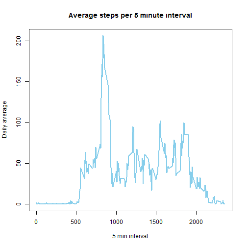

For the first peer assessment, a dataset on personal movement was used. The 
collected data includes two months worth of measurements, although there are 
several missing values. The data includes the number of steps taken in 5 minute
intervals during each day.
First, we load the data into R:


```r
setwd("~/Coursera/Reproducible Research/Peer assignment 1/RepData_PeerAssessment1")
data <- read.csv("activity.csv", stringsAsFactors = FALSE)
data_non_NA <- data[complete.cases(data), ]
```

For the first analyses, a dataset without NA values will be used. The first 
question in the dataset revolves around the mean steps taken by day. For this,
we build a dataset that includes the total number of steps for each date.


```r
day_total_steps <- tapply(data_non_NA$steps, data_non_NA$date,sum)
```

We now print a histogram of all the steps per day.


```r
hist(day_total_steps, main = "Histogram of steps by day", col = "sky blue", 
    xlab = "Steps by day", breaks = 10)
```

 

We can now calculate the median (10765) and mean 
(1.0766189 &times; 10<sup>4</sup>) of the total steps taken by day.


```r
summary(day_total_steps,digits = 8)
```

```
##     Min.  1st Qu.   Median     Mean  3rd Qu.     Max. 
##    41.00  8841.00 10765.00 10766.19 13294.00 21194.00
```

For the second question, we are interested in knowing the daily activity pattern.
We can take a look at it using the line  plot below.


```r
five_min_int <- tapply(data_non_NA$steps, data_non_NA$interval,mean)
plot(names(five_min_int), five_min_int, type="l", xlab = "5 min interval", 
     ylab = "Daily average", main = "Average steps per 5 minute interval",
     lwd = 2.5, col = "sky blue")
```

 

We can see from the chart and the calculation below that the interval with the most activity is the one that starts at 8:35 a.m., when 104 steps are taken on average.


```r
which.max(five_min_int)
```

```
## 835 
## 104
```

There are a lot of missing values in the dataset, in fact 2304.


```r
sum(is.na(data$steps))
```

```
## [1] 2304
```

To try to fill them out, we will impute them using the averages of the 5 minute intervals from the non-missing dataset. We can make a histogram to see how this looks after the imputation.


```r
imputed <- data
imputed[!complete.cases(imputed), "steps"] <- five_min_int[as.character(imputed[!complete.cases(imputed), 
    "interval"])]
day_total_steps_imputed <- tapply(imputed$steps, imputed$date, sum)
hist(day_total_steps_imputed, main = "Histogram of steps by day", col = "sky blue", 
    xlab = "Steps by day", breaks = 10)
```

 

As can be seen from the table below, the summary statistics remain very similar, since the averages from the original dataset are used for the imputation.


```r
summary(day_total_steps_imputed)
```

```
##    Min. 1st Qu.  Median    Mean 3rd Qu.    Max. 
##      41    9819   10770   10770   12810   21190
```

Finally, we will take a look at the patterns of activity during weekends and weekdays. The chart below shows that during the weekday a lot of the activity is concentrated in the morning, while in the case of the weekends it is spread out more evenly.


```r
wdays <- weekdays(as.Date(imputed$date))
wdays[wdays == "domingo" | wdays == "sábado"] <- "weekend"
wdays[wdays != "weekend"] <- "weekday"
imputed <- data.frame(imputed, wdays)

library(reshape2)
five_min_int_wday <- with(imputed, tapply(steps, list(interval, wdays), mean))
melted <- melt(five_min_int_wday, id = row.names(five_min_int_wday))
library(ggplot2)
ggplot(melted, aes(x = Var1, y = value, col = Var2)) + geom_line(size = 0.75) + 
    facet_grid(Var2 ~ .) + xlab("5 minute interval") + ylab("Average number of steps") + 
    ggtitle("Average number of steps by 5 minute interval") + theme(legend.position = "none")
```

 

